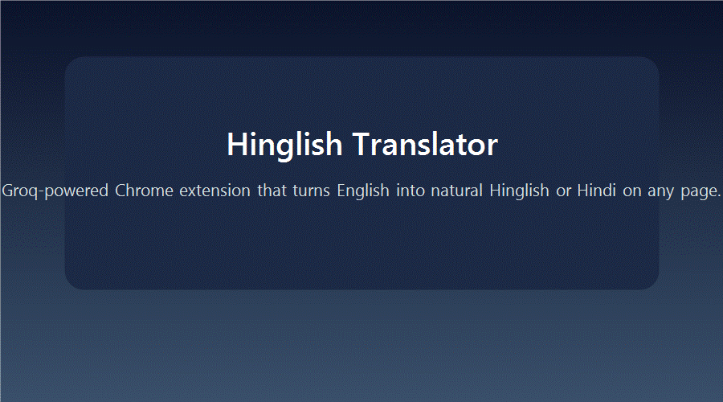

# Hinglish Translator · Chrome Extension

A Groq-powered Chrome extension that converts English text into natural Hinglish or Hindi without leaving the page. Highlight any sentence, pick a style, and get an instant translation or explanation in a tone that matches your audience.



## Feature Highlights
- **Context-aware translations** with Groq LLaMA 4 Scout so idioms and tone survive the jump to Hinglish/Hindi.
- **Multiple personas**: Hinglish, Hindi (Devanagari), Romanised Hindi, plus formal and casual modes.
- **Language mix control** to bias output toward more Hindi or more English on demand.
- **In-page popups** that respect light/dark themes and never reload the site you are reading.
- **Explain mode** for richly formatted bullet explanations in the same voice as your translation settings.

## What makes it different?
- Uses Groq's ultra-low latency chat completions API for snappy responses.
- Background service worker caches recent translations/explanations to avoid duplicate calls.
- Automatic theme sync between the welcome screen and popup for a consistent feel.
- Friendly warnings and recovery flows when the API key is missing or invalid.

## Getting Started

### Prerequisites
- Google Chrome 114+ (or any Chromium browser with Manifest V3 support).
- A Groq API key (create one at <https://console.groq.com/keys>).

### Install from source
1. Clone or download this repository.
2. Open `chrome://extensions/` in Chrome.
3. Enable **Developer mode** in the top-right corner.
4. Click **Load unpacked** and select the repository folder.

### Configure the extension
1. Click the Hinglish Translator icon in your toolbar.
2. Enter your Groq API key on the welcome screen. The key stays on your device in Chrome storage.
3. Pick your preferred translation style and language balance.
4. Optional: toggle the popup theme and personalise settings at any time.

## Usage Guide
- **Translate text:** highlight any sentence, right-click, and choose **Translate to Hinglish**. A popup appears directly on the page.
- **Explain text:** highlight, right-click, and choose **Explain in Hinglish** for a structured summary.
- **Full page translation:** open the popup and trigger page translation (respects your selected style and level).
- **Quick tweaks:** the popup exposes language mix and tone controls without reloading.

## Project Structure
```
+- background.js          # Service worker: context menus, Groq API orchestration, caching
+- content.js             # In-page translation logic and UX helpers
+- popup/                 # Popup + welcome screens (HTML/CSS/JS)
+- styles/content.css     # Styling for injected popups
+- utils/translationHelper.js
+- _locales/en/messages.json
+- docs/demo.gif          # Animated README demo
```

## Technical Notes
- Manifest V3 extension using the Chrome Scripting, Storage, Tabs, and Context Menus APIs.
- Groq chat completions (`meta-llama/llama-4-scout-17b-16e-instruct`) for both translation and explanation flows.
- Background worker caches translations/explanations by text + style to cut duplicate calls and reduce latency.
- Content script debounces page translations and honours max-length guards to protect API usage.
- Popup/welcome screens share theme + API key validation logic for a consistent onboarding experience.

## Roadmap Ideas
- Batch translation queue for long-form articles.
- Exportable translation history with search.
- Custom phrase replacement rules per domain.
- Offline fallback using locally bundled dictionaries.

## Contributing
Pull requests are welcome. Please read [CONTRIBUTING.md](CONTRIBUTING.md) for coding standards, branching tips, and issue templates.

## License
This project is licensed under the terms of the [LICENSE.md](LICENSE.md) file.
